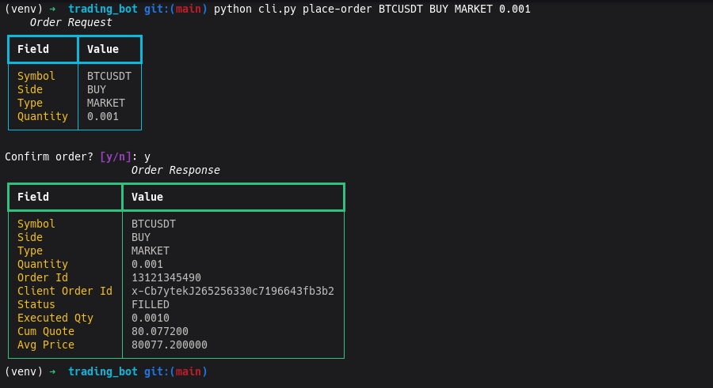
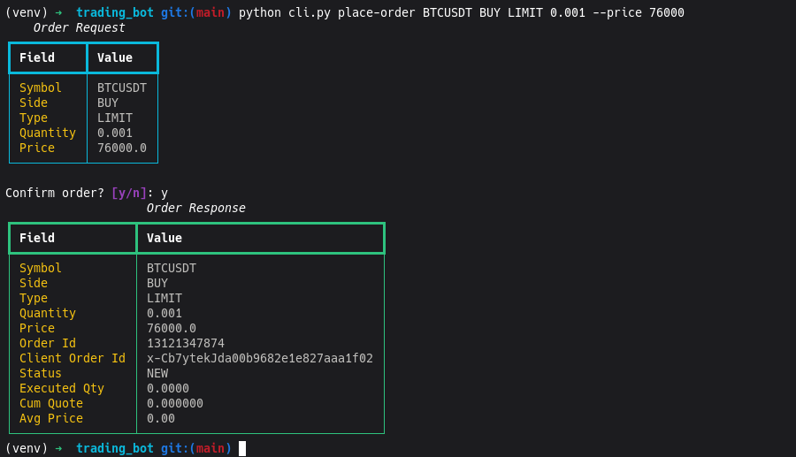
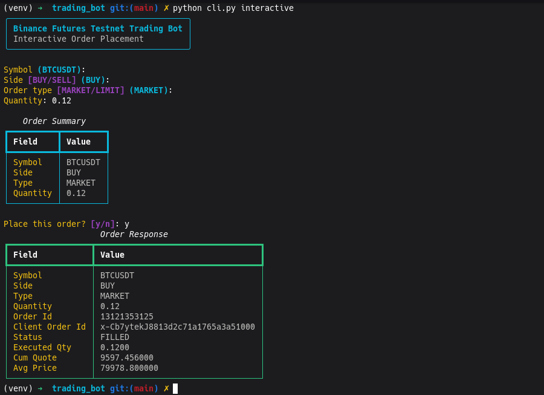
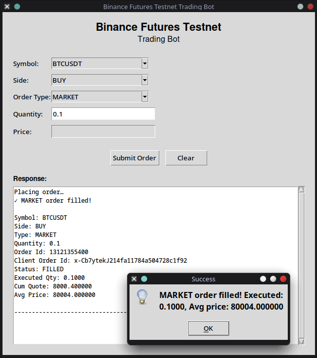
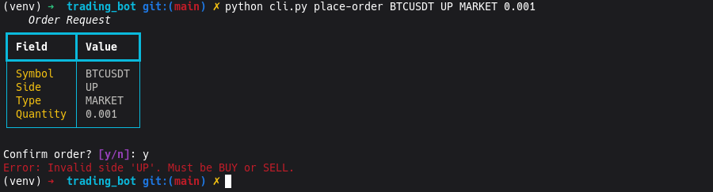
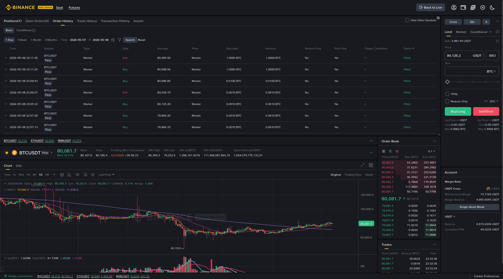
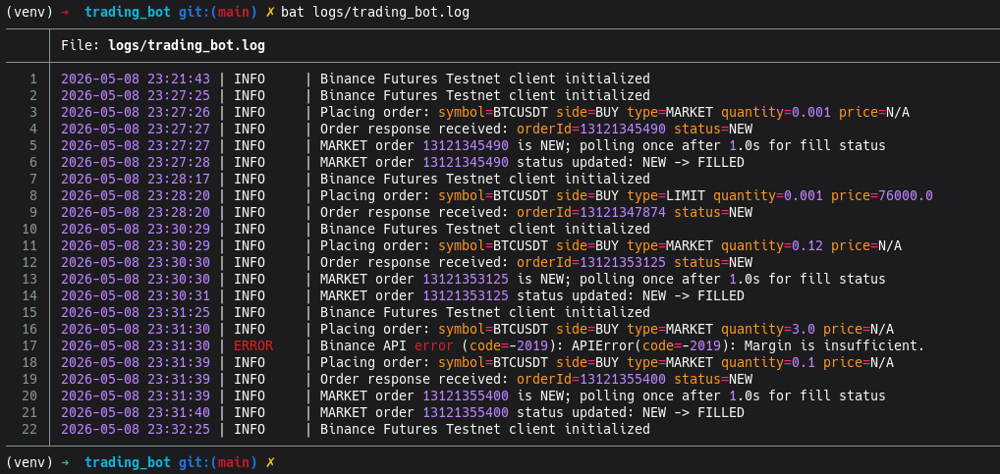

# Binance Futures Testnet Trading Bot

A clean, beginner-friendly trading bot for **Binance Futures Testnet** with
CLI (Typer + Rich) and GUI (tkinter) interfaces. Built for stability,
readability, and proper error handling — no overengineering.

---

## Features

- **Market & Limit orders** — BUY and SELL on Binance Futures Testnet
- **Dual interface** — CLI with direct + interactive modes, and a lightweight
  desktop GUI
- **Input validation** — side, order type, quantity, and price are validated
  before reaching the API
- **Structured logging** — all API requests, responses, errors, and validation
  failures are logged to `logs/trading_bot.log`
- **Error handling** — graceful handling of invalid input, API errors, network
  failures, and unexpected exceptions
- **No hardcoded secrets** — API credentials are loaded from `.env` via
  `python-dotenv`

---

## Architecture

```
trading_bot/
│
├── bot/                  # Core logic (reused by both interfaces)
│   ├── client.py         # Binance Futures Testnet client wrapper
│   ├── orders.py         # Order placement & response formatting
│   ├── validators.py     # Input validation functions
│   ├── logging_config.py # Logging setup (file + console)
│   └── exceptions.py     # Custom exception hierarchy
│
├── gui/
│   └── app.py            # tkinter desktop GUI
│
├── cli.py                # Typer CLI (direct + interactive + gui commands)
├── logs/                 # Log output directory
├── public/               # Screenshots
│
├── requirements.txt
├── .env.example
├── .gitignore
├── README.md
├── BUGS_AND_FIXES.md
└── ASSUMPTIONS.md
```

### Layered design

```
User (CLI / GUI)
    │
    ▼
OrderManager (bot/orders.py)   ← validation via bot/validators.py
    │
    ▼
BinanceFuturesClient (bot/client.py)   ← error handling, logging
    │
    ▼
python-binance library
    │
    ▼
Binance Futures Testnet API
```

Both CLI and GUI import from the same `bot` package — no duplicated API
logic.

---

## Setup

### Prerequisites

- Python 3.9+
- A Binance Futures Testnet account
- Testnet API key and secret

### Installation

```bash
# Clone or navigate to the project directory
cd trading_bot

# Create a virtual environment (recommended)
python -m venv venv
source venv/bin/activate    # Linux / macOS
venv\Scripts\activate       # Windows

# Install dependencies
pip install -r requirements.txt
```

### Environment variables

```bash
cp .env.example .env
```

Edit `.env` and add your Testnet API credentials:

```
BINANCE_TESTNET_API_KEY=your_api_key_here
BINANCE_TESTNET_API_SECRET=your_api_secret_here
```

> Get your keys at [testnet.binancefuture.com](https://testnet.binancefuture.com/).

---

## CLI Usage

```bash
# Show help
python cli.py --help

# Place an order directly
python cli.py place-order BTCUSDT BUY MARKET 0.001

# Place a LIMIT order
python cli.py place-order BTCUSDT BUY LIMIT 0.001 --price 30000

# Interactive mode (step-by-step prompts)
python cli.py interactive

# Launch the GUI from the terminal
python cli.py gui
```

### `place-order` command arguments

```
python cli.py place-order SYMBOL SIDE ORDER_TYPE QUANTITY [--price PRICE]
```

| Argument                | Description                       |
|-------------------------|-----------------------------------|
| `SYMBOL`                | Trading pair (e.g. BTCUSDT)       |
| `SIDE`                  | BUY or SELL                       |
| `ORDER_TYPE`            | MARKET or LIMIT                   |
| `QUANTITY`              | Order quantity                    |
| `--price, -p`  (option) | Price — required for LIMIT orders |

> **Note**: Negative quantities (for testing validation) require `-- ` before
> the value, e.g. `python cli.py place-order BTCUSDT BUY MARKET -- -1`.
> This is standard CLI behaviour — tokens starting with `-` are parsed as
> options. Interactive and GUI modes handle negative values natively.

### Interactive mode

Run `python cli.py interactive` and follow the prompts. The tool displays a
summary before confirming the order, then shows the API response.

---

## Exchange-specific validations

Binance Futures enforces several trading rules that cannot be fully validated
locally without fetching per-symbol filters:

| Validation | Description |
|------------|-------------|
| **Price filters** | LIMIT orders must be within a percentage of the mark price |
| **Tick size** | Price must conform to the symbol's tick size (e.g. 0.01 for BTCUSDT) |
| **Lot size** | Quantity must be a multiple of the symbol's `stepSize` |
| **Min / max notional** | Order value (`qty × price`) must be within allowed bounds |
| **Max quantity** | Each symbol has a maximum order quantity |

The bot validates `quantity > 0`, `price > 0`, and correct side/type values
before sending orders. Binance's own filters handle the symbol-specific rules.

> **Future improvement**: Pre-fetch `exchangeInfo` filters for the target
> symbol and validate locally before submission.

---

## GUI Usage

```bash
python cli.py gui
```

Or directly:

```bash
python -m gui.app
```

The GUI provides a clean form with:

- Symbol dropdown (fetched live from exchange info)
- BUY / SELL dropdown
- MARKET / LIMIT dropdown
- Quantity input
- Price input (automatically disabled for MARKET, enabled for LIMIT)
- Submit and Clear buttons
- Scrollable response output area

Orders are executed in a background thread to keep the interface responsive.

---

## Logging

All logs are written to `logs/trading_bot.log` in the format:

```
2025-01-15 10:30:45 | INFO     | Placing order: symbol=BTCUSDT side=BUY type=MARKET quantity=0.001 price=N/A
2025-01-15 10:30:46 | INFO     | Order response received: orderId=12345678 status=FILLED
2025-01-15 10:30:46 | ERROR    | Binance API error: Invalid symbol
```

- **INFO**: order placement, successful responses
- **WARNING**: configuration issues
- **ERROR**: API errors, validation failures, network problems
- Console output shows WARNING+ by default; the log file contains everything

API secrets are **never** logged.

---

## Screenshots

---

### CLI — Market Order Execution

Demonstrates successful MARKET order placement through the CLI with
formatted request/response output.



---

### CLI — Limit Order Execution

Shows LIMIT order placement with price handling and structured response
formatting.



---

### Interactive CLI Mode

Step-by-step guided order placement workflow with prompts, validation,
and confirmation.



---

### Lightweight Desktop GUI

Minimal tkinter-based desktop interface with dropdowns, validation, and
live order submission.



---

### Validation & Error Handling

Example of graceful validation feedback for invalid user input.



---

### Binance Futures Testnet Verification

Orders successfully appearing in Binance Futures Testnet order history.



---

### Structured Logging

Example log output showing API requests, responses, and error tracking.



---

## Assumptions

See [ASSUMPTIONS.md](ASSUMPTIONS.md) for a complete list of design and
runtime assumptions.

---

## Known issues & fixes

See [BUGS_AND_FIXES.md](BUGS_AND_FIXES.md) for documented bugs encountered
during development.

---

## Future improvements

- Pre-fetch `exchangeInfo` filters for local precision and lot-size validation
- Order cancellation, position tracking, and balance display
- Configurable log levels via `.env`
- Installable package (`pyproject.toml` / `setup.py`)
- Unit tests for validators and order formatting


---

## Interested in collaborating, Contact Me:

#### Praneeth Varma Kopperla
GitHub: https://github.com/pvk-96

Email: praneethvarmakopperla@gmail.com

Portfolio: https://pvk96.in

